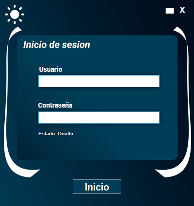
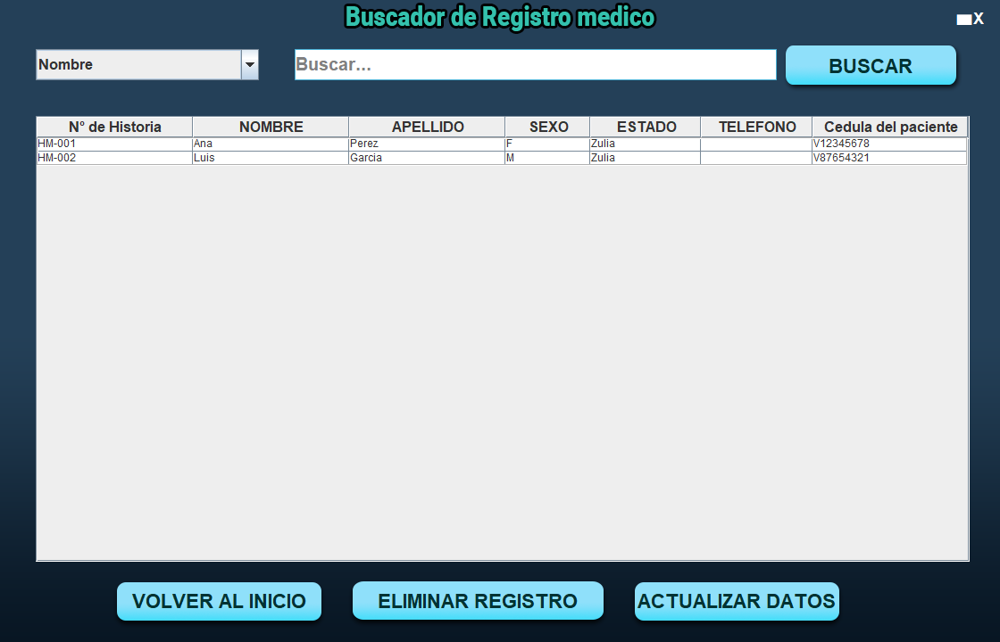
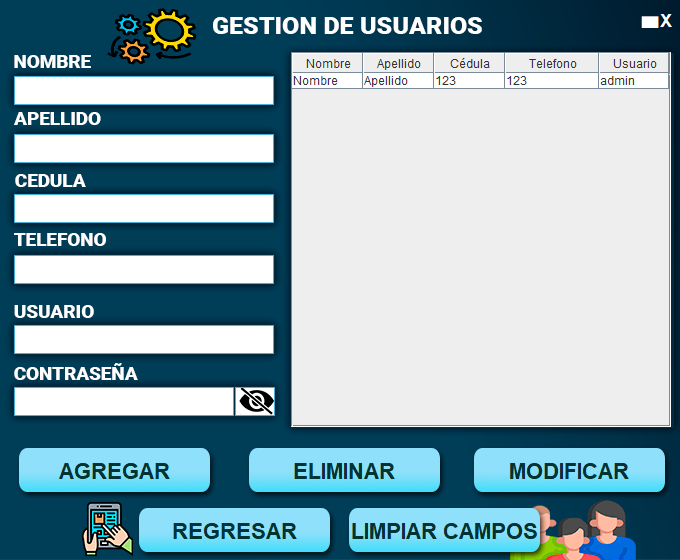
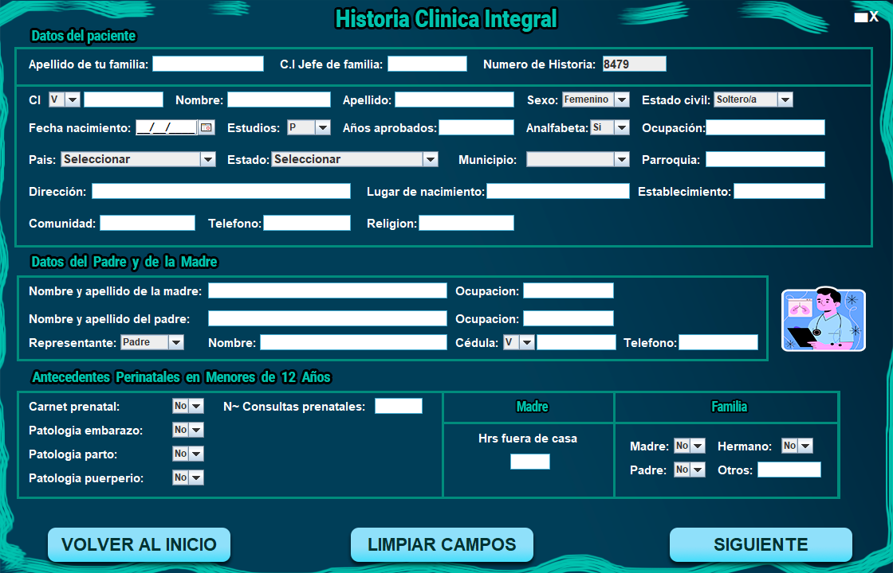
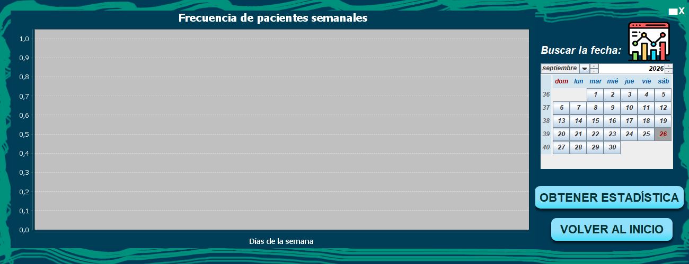

# Registro Médico

<p align="center">
  
</p>

**Aplicación de escritorio (Java Swing)** para el registro y control de historias clínicas. Proyecto universitario para la **Universidad Nacional Experimental Rafael María Baralt (UNERMB)**, orientado a un centro clínico ambulatorio.

Centro de referencia: **Centro Clínico Ambulatorio Federación “María S. Soto de Cedeño”**.

<p align="center">
  
</p>

---

## ¿Qué es?

Sistema local para gestionar el historial médico de pacientes: alta de historias, búsqueda y actualización, usuarios con roles, impresión PDF y estadísticas. Interfaz con **tema claro/oscuro**.

| | |
|--|--|
| **Versión** | 1.3 (ver [Changelog.md](./Changelog.md)) |
| **Lenguaje** | Java 8+ (probado también con JDK 17) |
| **UI** | Swing (ventanas personalizadas) |
| **Base de datos** | MySQL / MariaDB (XAMPP o Docker) |
| **Build** | Maven (`pom.xml`) |

---

## Capturas

| Login | Menú |
| :---: | :---: |
|  |  |

| Buscador | Gestión de usuarios |
| :---: | :---: |
|  |  |

| Nueva historia clínica | Estadísticas |
| :---: | :---: |
|  |  |

---

## Características

- **Login** con usuarios y niveles de acceso: `lectura`, `modificacion`, `administrador`
- **Nueva historia médica** (formulario multiparte)
- **Búsqueda** de registros con filtros
- **Actualización** de historias existentes
- **Gestión de usuarios** (según rol)
- **Impresión / PDF** (iText)
- **Estadísticas** (JFreeChart)
- **Tema claro / oscuro**
- Catálogo de **países y estados** (BD auxiliar)

---

## Requisitos

- **JDK 8+** (OpenJDK / Oracle / Microsoft Build of OpenJDK)
- **Maven 3.8+** (para compilar desde el código)
- **MySQL 8** o **MariaDB** (XAMPP, servicio local o Docker)
- Puerto **3306** libre

---

## Base de datos

La app espera dos bases en `localhost:3306` con usuario `root` y **contraseña vacía** (por defecto en el código):

| Base | Uso | Script |
|------|-----|--------|
| `historia_clinica_integral` | Pacientes y usuarios | `BDD/Tabla Datos medicos.sql`, `BDD/Tabla de usuarios.sql` |
| `apaises_estados_del_mundo` | Países / estados | `BDD/apaises_estados_del_mundo.sql` |

Credenciales de prueba (tras importar usuarios):

| Usuario | Contraseña | Rol |
|---------|------------|-----|
| `admin` | `contrasena3` | administrador |

### Opción A — XAMPP

1. Inicia **Apache** y **MySQL** en XAMPP.
2. Abre phpMyAdmin → crea las dos bases (o importa los `.sql` directamente).
3. Importa los archivos de la carpeta `BDD/`.

### Opción B — Docker

```powershell
docker run -d --name registro-mysql `
  -e MYSQL_ALLOW_EMPTY_PASSWORD=yes `
  -p 3306:3306 `
  mysql:8.0

# Cuando MySQL esté listo:
docker exec -i registro-mysql mysql -uroot -e "CREATE DATABASE IF NOT EXISTS historia_clinica_integral; CREATE DATABASE IF NOT EXISTS apaises_estados_del_mundo;"
Get-Content "BDD\Tabla Datos medicos.sql" -Raw | docker exec -i registro-mysql mysql -uroot historia_clinica_integral
Get-Content "BDD\Tabla de usuarios.sql" -Raw | docker exec -i registro-mysql mysql -uroot historia_clinica_integral
Get-Content "BDD\apaises_estados_del_mundo.sql" -Raw | docker exec -i registro-mysql mysql -uroot apaises_estados_del_mundo
```

> La conexión está en `src/main/java/com/usd89/DatabaseConnection/Conexion.java`. Si tu MySQL tiene contraseña, cámbiala ahí.

---

## Compilar y ejecutar

```powershell
cd registro_medico

# Compilar JAR ejecutable (shade)
mvn -DskipTests package

# Ejecutar
java -jar target\registro_medico-1.0-SNAPSHOT.jar
```

La clase principal es `com.usd89.registro.Inicio`.

### JAR precompilado

También puedes usar el `.jar` publicado en el README original (Mega), siempre con MySQL configurado.

```bash
java -jar registro_medico.jar
```

---

## Estructura del proyecto

```
registro_medico/
├── BDD/                         # Scripts SQL
├── docs/images/                 # Capturas para documentación
├── src/main/java/com/usd89/
│   ├── DatabaseConnection/      # JDBC MySQL + localidades
│   └── registro/                # Ventanas Swing
│       ├── Inicio.java          # Login (main)
│       ├── Menu.java
│       ├── NHM.java             # Nueva historia
│       ├── NHM_Actualizar.java
│       ├── Buscador.java
│       ├── GestionUsuarios.java
│       ├── Grafica.java
│       └── Elementos.java       # UI helpers
├── src/main/resources/imagen/   # Iconos y fondos (claro/oscuro)
├── pom.xml
├── Changelog.md
└── README.md
```

---

## Stack

| Tecnología | Uso |
|------------|-----|
| Java / Swing | Interfaz de escritorio |
| MySQL Connector/J | Acceso a datos |
| iText 5 | Generación PDF |
| JFreeChart | Gráficas |
| JCalendar | Selector de fechas |
| Maven Shade | JAR ejecutable |

---

## Documentación relacionada

- Historial de versiones: [Changelog.md](./Changelog.md)
- Seguridad: [SECURITY.md](./SECURITY.md)
- Licencia: [LICENSE](./LICENSE)

---

*Registro Médico · UNERMB · v1.3*
